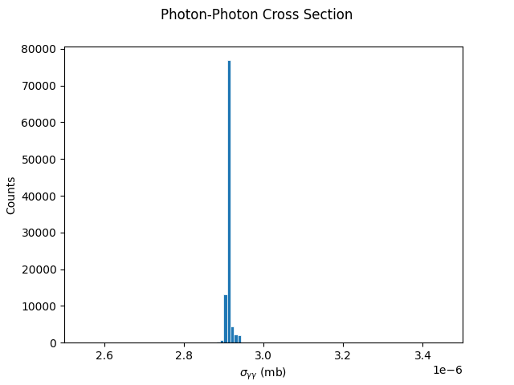
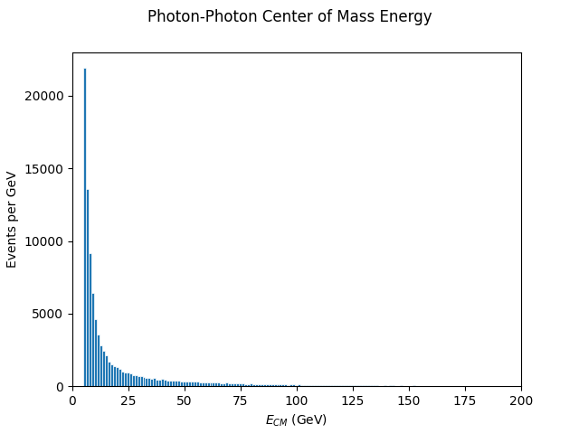
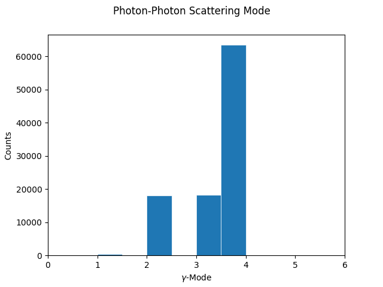

# c3-pythia

This small contribution is for studying backgrounds using Pythia for Cool Copper Collider (C3)

You can build and run the Pythia executable if you have access to CERN cvmfs on your machine.
Otherwise, you can build it if you have Pythia installed elsewhere, but you need to change Makefile.inc and setup.sh suitably.

Building:
```make```

To produce pytree.root file:
```./gamma-gamma```

To produce plots you need python environment with uproot, numpy and matplotlib.

To produce the plots:
```python plot.py```

To produce a dump of branch names all event global information and particle-by-particle information:
```python print_root_content.py```

Enjoy adding more plots following the plot.py example.

Here are some examples from me:






